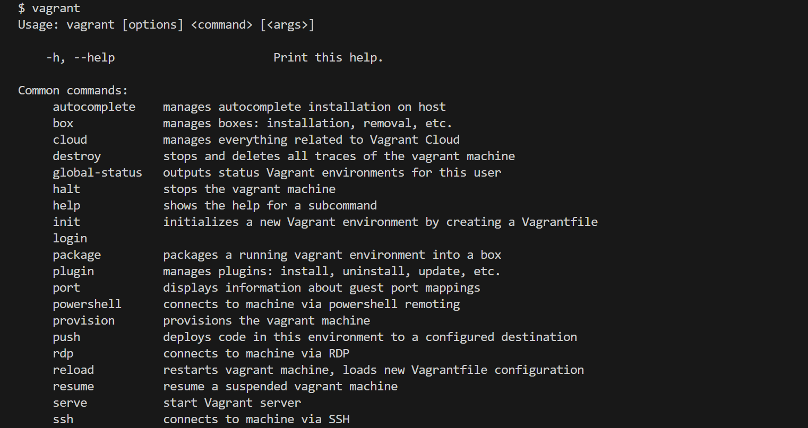
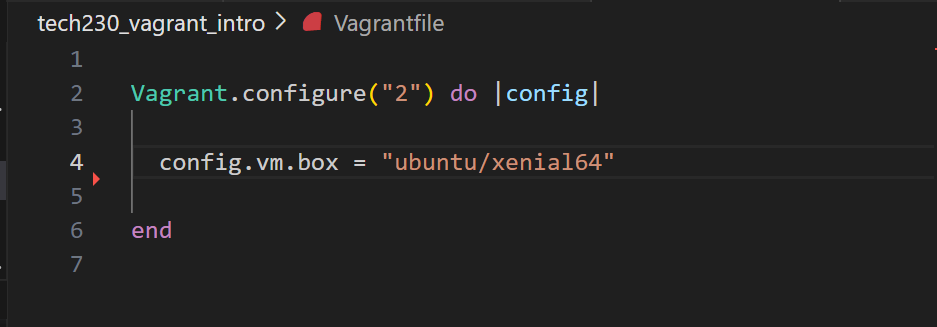

# How to create a virtual machine using vagrant via virtual box and install and run nginx

### Download VirtualBox

Install VirtualBox: Download and install VirtualBox from the official website: https://www.virtualbox.org/wiki/Downloads 
The latest version is 7, but the most stable version is 6.1, this is what I use.

### Download Vagrant

Install Vagrant: Download and install Vagrant from the official website: https://www.vagrantup.com/downloads
There are a couple of options to pick from, but if you are unclear on what version you want, pick the AMD64 version. 
To check it works, open git bash terminal and type in:
[code]vagrant

The list of commands shows it is installed successfully.

### Change your directory

Use command:
[code]cd<directory name>
In my case its:
[code]cd tech230_vagrant_intro
.png)
### Create a Vagrant file

To initilise Vagrant, run the command:
[code]vagrant init
This will create a new Vagrant file in the current directory

### Create a virtual machine

To create a virtual machine, run the command:
[code]vagrant up

Then go to your terminal and type the command:
[code]vagrant ssh
This will generate ssh keys that we can use to secure shell to vagrant.
You have been successful when you see the change of the name in the terminal, it should say:
'vagrant@ubuntu-xenial:~$' in green and from here on we are in Linux and will be using th suitable commands.

### Update packages

To get the latest update for our VM type the command:
[code]sudo apt-get update
The code means:
- sudo = super user do - This gives you admin rights for that command.
- apt-get = This tells the computer to go get the packages
This command just tells us the packages that can be updated but does not upgrade them.

### Upgrade packages

To upgrade our VM type the command:
[code]sudo apt-get upgrade
When prompted press 'Y' - or to skip this, type this command:
[code]sudo apt-get upgrade -y

### Installing nginx

To install nginx, type the command:
[code]sudo apt-get install nginx -y
To start nginx, type the command:
[code]sudo systemctl start
To check the status, type command:
[code]sudo systemctl status
(This last command kicks you from the VM so press ctrl + c and then vagrant ssh)

### Linking an IP

The VM needs an IP address so it has a destination.

Add:
[code]config.vm.network "private_network", ip:"192.168.10.100"
To your Vagrant file, under:
[code]config.vm.box = "ubuntu/xenial64"
It should look like this:

Finally to check you're connected go to the IP:
[code]192.168.10.100
And you should see this:
.png)